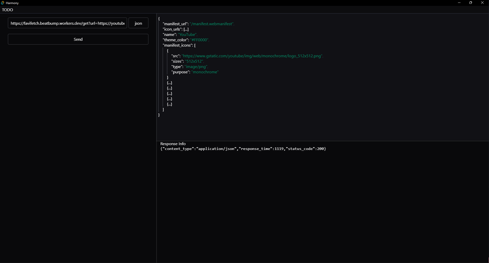

# Harmony

An API Debugger and Request Client.

Created with Rust, Tauri, and Svelte!

**Warning**: this is a _very early prototype_.

## Screenshots

|  |  |
| --------------------------------------------------- | --------------------------------------------------- |
| `GET` JSON Response Preview                         | `GET` Web Preview                                   |

> TODO! README and finish MVP
